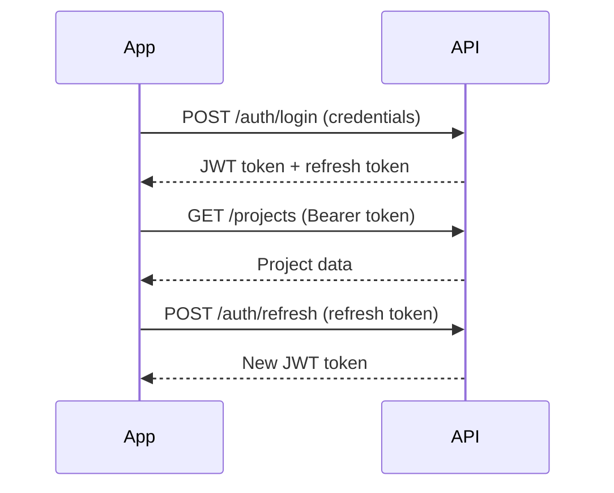

# VSO Monitor - Android Mobile Application Specification

## Version 1.0.0
**Date**: 2025-09-06  
**Author**: System Architecture Team  
**Status**: Draft

---

## 1. Executive Summary

### 1.1 Purpose
VSO Monitor is a native Android application designed to provide mobile access to the Vertical Slice Orchestration (VSO) system, enabling users to monitor project statuses, view specifications, track tmux_orchestrator processing, and manage AI agent activities remotely.

### 1.2 Goals
- **Real-time Monitoring**: Live updates of project processing and agent activities
- **Mobile Management**: Queue management and project control from mobile devices
- **Push Notifications**: Instant alerts for critical events and status changes
- **Offline Capability**: Cached data access when disconnected
- **Security**: Secure authentication and encrypted communications

### 1.3 Target Users
- DevOps engineers monitoring production orchestrations
- Project managers tracking multi-agent development progress
- System administrators managing VSO infrastructure
- Developers debugging agent behaviors remotely

---

## 2. Functional Requirements

### 2.1 Core Features

#### 2.1.1 Dashboard
- **Project Overview Widget**: Active/queued/completed project counts
- **System Health Indicators**: CPU, memory, active sessions
- **Recent Activity Feed**: Last 10 project status changes
- **Quick Actions**: Start/stop scheduler, pause queue processing

#### 2.1.2 Project Management
```
Features:
- View all projects with filterable list (status, date, priority)
- Project detail view with:
  - Specification content (markdown rendered)
  - Current status and progress percentage
  - Session information (tmux session names)
  - Agent assignments and roles
  - Git repository information
  - Execution timeline with milestones
- Actions:
  - Queue new project from saved specs
  - Pause/resume processing
  - Mark as completed/failed
  - Retry failed projects
  - View/download logs
```

#### 2.1.3 Live Orchestration Monitoring
```
Real-time Views:
- Agent Activity Monitor:
  - Current agent status (active/idle/error)
  - Live tmux pane content streaming
  - Message queue for each agent
  - CPU/memory usage per agent
- Session Viewer:
  - Tmux session tree visualization
  - Window/pane navigation
  - Live terminal output (read-only)
  - Screenshot capture capability
- Progress Tracking:
  - Task completion percentage
  - Time elapsed/estimated
  - Milestone achievements
  - Blocker detection alerts
```

#### 2.1.4 Specification Browser
```
Capabilities:
- Browse spec library with categories
- Search specs by keywords/tags
- View spec details with syntax highlighting
- Edit specs (with validation)
- Create new specs from templates
- Import specs from URLs/files
- Version history tracking
```

#### 2.1.5 Queue Management
```
Queue Operations:
- View queue with priority sorting
- Drag-and-drop reordering
- Batch operations (pause/resume/cancel)
- Queue statistics and analytics
- Credit usage monitoring
- Schedule future executions
```

#### 2.1.6 Agent Control
```
Agent Management:
- List all agents with health status
- Send messages to specific agents
- View agent conversation history
- Restart/reset stuck agents
- Role reassignment
- Performance metrics per agent
```

#### 2.1.7 Notifications & Alerts
```
Notification Types:
- Project completed/failed
- Agent errors or stuck states
- Queue processing issues
- System resource alerts
- Scheduled task reminders
- Custom alert rules
```

### 2.2 Advanced Features

#### 2.2.1 Analytics Dashboard
- Project success/failure rates
- Average completion times by project type
- Agent performance metrics
- Resource utilization trends
- Cost analysis (API credits used)

#### 2.2.2 Collaboration Tools
- Share project status via deep links
- Team member activity feed
- Comments on projects/specs
- Approval workflows for production deploys

#### 2.2.3 Integration Features
- GitHub webhook receivers
- Slack/Discord notifications forwarding
- JIRA ticket creation from failures
- CI/CD pipeline triggers

---

## 3. Technical Requirements

### 3.1 Architecture

#### 3.1.1 Client Architecture
```kotlin
Architecture Pattern: MVVM with Clean Architecture

Layers:
- Presentation Layer:
  - Activities/Fragments
  - ViewModels
  - Compose UI components
  
- Domain Layer:
  - Use cases
  - Domain models
  - Repository interfaces
  
- Data Layer:
  - Repository implementations
  - Remote data sources (Retrofit)
  - Local data sources (Room)
  - WebSocket managers
```

#### 3.1.2 Technology Stack
```yaml
Language: Kotlin
Minimum SDK: 24 (Android 7.0)
Target SDK: 34 (Android 14)

Core Libraries:
  - Jetpack Compose: UI framework
  - Hilt: Dependency injection
  - Retrofit: REST API client
  - OkHttp: HTTP client with interceptors
  - Scarlet: WebSocket client
  - Room: Local database
  - WorkManager: Background tasks
  - Navigation Component: Screen navigation
  - DataStore: Preferences storage
  
Additional Libraries:
  - Coil: Image loading
  - Timber: Logging
  - LeakCanary: Memory leak detection
  - Firebase: Push notifications & analytics
  - Markwon: Markdown rendering
  - MPAndroidChart: Data visualization
```

### 3.2 Backend API Requirements

#### 3.2.1 REST API Endpoints
```yaml
Base URL: https://api.vso-monitor.com/v1

Authentication:
  POST /auth/login
  POST /auth/refresh
  POST /auth/logout

Projects:
  GET /projects
  GET /projects/{id}
  POST /projects
  PUT /projects/{id}
  DELETE /projects/{id}
  GET /projects/{id}/logs
  GET /projects/{id}/metrics

Queue:
  GET /queue
  POST /queue/add
  PUT /queue/reorder
  DELETE /queue/{id}

Agents:
  GET /agents
  GET /agents/{id}
  POST /agents/{id}/message
  POST /agents/{id}/restart

Sessions:
  GET /sessions
  GET /sessions/{id}/windows
  GET /sessions/{id}/capture

Specs:
  GET /specs
  GET /specs/{id}
  POST /specs
  PUT /specs/{id}
```

#### 3.2.2 WebSocket Events
```javascript
Connection: wss://api.vso-monitor.com/ws

Events:
  - project.status.changed
  - agent.status.changed
  - queue.updated
  - session.output
  - system.alert
  - agent.message
```

### 3.3 Security Requirements

#### 3.3.1 Authentication & Authorization
- OAuth 2.0 with refresh tokens
- Biometric authentication support
- Role-based access control (RBAC)
- API key management for service accounts

#### 3.3.2 Data Security
- TLS 1.3 for all network communications
- Certificate pinning for API endpoints
- Encrypted local storage for sensitive data
- Secure credential storage using Android Keystore

#### 3.3.3 Privacy
- GDPR compliance for EU users
- Data retention policies
- User consent for analytics
- Audit logging for all actions

---

## 4. UI/UX Requirements

### 4.1 Design Principles
- **Material Design 3**: Following latest Google design guidelines
- **Dark Mode**: Full dark theme support with OLED optimization
- **Responsive**: Adapt to phones, tablets, and foldables
- **Accessibility**: WCAG 2.1 AA compliance

### 4.2 Screen Mockups

#### 4.2.1 Main Dashboard
```
┌─────────────────────────────┐
│  ≡  VSO Monitor    🔔  👤   │
├─────────────────────────────┤
│ ┌─────────┬─────────┬──────┐│
│ │Active: 3│Queue: 12│Done:45││
│ └─────────┴─────────┴──────┘│
│                              │
│ Recent Activity              │
│ ┌──────────────────────────┐ │
│ │✅ Project-123 completed  │ │
│ │🔄 Project-124 processing │ │
│ │❌ Project-122 failed     │ │
│ └──────────────────────────┘ │
│                              │
│ System Health: ●●●●○         │
│                              │
│ [+ New Project] [View Queue] │
└─────────────────────────────┘
```

#### 4.2.2 Project Detail
```
┌─────────────────────────────┐
│  ←  Project-124      ⋮      │
├─────────────────────────────┤
│ Status: PROCESSING          │
│ Progress: ████████░░ 75%    │
│                              │
│ Agents (5)                  │
│ ● Orchestrator - Active     │
│ ● Developer - Writing code  │
│ ● Tester - Running tests    │
│ ● PM - Reviewing            │
│ ● DevOps - Idle             │
│                              │
│ [View Logs] [Send Message]  │
│                              │
│ Timeline                     │
│ 10:30 - Project started     │
│ 10:45 - Development phase   │
│ 11:15 - Testing initiated   │
│ 11:30 - Current             │
└─────────────────────────────┘
```

### 4.3 Navigation Structure
```
Bottom Navigation:
- Dashboard (Home)
- Projects (List/Grid view)
- Queue (Management)
- Agents (Monitor)
- Settings (Profile/Preferences)

Drawer Navigation:
- Analytics
- Specifications
- Sessions
- Notifications
- Help & Support
```

---

## 5. Performance Requirements

### 5.1 Response Times
- App launch: < 2 seconds
- Screen transitions: < 300ms
- API responses: < 1 second (cached)
- Live updates: < 500ms latency

### 5.2 Resource Usage
- APK size: < 25MB
- Memory usage: < 150MB typical
- Battery optimization: Doze mode compatible
- Network: Adaptive quality based on connection

### 5.3 Offline Capabilities
- Cache last 50 projects locally
- Queue viewing without connection
- Sync pending actions when online
- Offline spec editing with conflict resolution

---

## 6. Testing Requirements

### 6.1 Unit Testing
- Minimum 80% code coverage
- All ViewModels tested
- Repository layer mocked
- Use case validation

### 6.2 Integration Testing
- API endpoint testing
- WebSocket connection handling
- Database migrations
- Background job execution

### 6.3 UI Testing
- Espresso tests for critical flows
- Screenshot testing for UI consistency
- Accessibility testing with TalkBack
- Performance profiling

---

## 7. Deployment & Distribution

### 7.1 Release Channels
- **Internal Testing**: Daily builds for team
- **Beta Channel**: Weekly releases via Play Console
- **Production**: Bi-weekly releases
- **Enterprise**: Custom APK distribution

### 7.2 Update Mechanism
- In-app update prompts for critical fixes
- Staged rollouts (5% → 25% → 50% → 100%)
- Feature flags for gradual feature release
- Rollback capability for critical issues

### 7.3 Monitoring
- Crashlytics for crash reporting
- Analytics for user behavior
- Performance monitoring
- Custom event tracking

---

## 8. Future Enhancements (v2.0)

### 8.1 Planned Features
- **Voice Commands**: "Hey VSO, show me failed projects"
- **AR Visualization**: 3D project dependency graphs
- **Wear OS Companion**: Smartwatch notifications
- **Desktop Sync**: Continuity across devices
- **AI Insights**: Predictive failure analysis
- **Plugin System**: Third-party integrations

### 8.2 Platform Expansion
- iOS version (SwiftUI)
- Web PWA version
- Desktop clients (Electron)
- CLI companion tool

---

## 9. Development Timeline

### Phase 1: Foundation (Weeks 1-4)
- Project setup and architecture
- Authentication system
- Basic project listing
- Core API integration

### Phase 2: Core Features (Weeks 5-8)
- Live monitoring
- Queue management
- Agent control
- Push notifications

### Phase 3: Advanced Features (Weeks 9-12)
- Analytics dashboard
- Offline support
- Spec editor
- WebSocket integration

### Phase 4: Polish & Launch (Weeks 13-16)
- UI refinements
- Performance optimization
- Testing & bug fixes
- Play Store submission

---

## 10. Success Metrics

### 10.1 Key Performance Indicators
- Daily Active Users (DAU) > 100
- Average session duration > 5 minutes
- Crash-free rate > 99.5%
- App store rating > 4.5 stars
- API response time < 500ms p95

### 10.2 User Satisfaction
- Feature adoption rate > 60%
- User retention (30-day) > 40%
- Support ticket volume < 5% of DAU
- Feature request implementation rate > 50%

---

## Appendices

### A. API Authentication Flow


### B. Database Schema
```sql
-- Local Room database schema
CREATE TABLE projects (
    id INTEGER PRIMARY KEY,
    name TEXT NOT NULL,
    status TEXT NOT NULL,
    spec_path TEXT,
    created_at INTEGER,
    updated_at INTEGER,
    cached_at INTEGER
);

CREATE TABLE agents (
    id INTEGER PRIMARY KEY,
    project_id INTEGER,
    name TEXT NOT NULL,
    role TEXT,
    status TEXT,
    FOREIGN KEY (project_id) REFERENCES projects(id)
);

CREATE TABLE notifications (
    id INTEGER PRIMARY KEY,
    type TEXT NOT NULL,
    title TEXT,
    message TEXT,
    timestamp INTEGER,
    read INTEGER DEFAULT 0
);
```

### C. Sample API Responses
```json
// GET /projects/{id}
{
  "id": 131,
  "name": "batch-prop-20250905165836-1",
  "status": "processing",
  "progress": 75,
  "spec_path": "/specs/batch_prop.json",
  "session_id": "batch-prop-202509051-cd735346",
  "agents": [
    {
      "id": "orchestrator",
      "role": "Orchestrator",
      "status": "active",
      "last_message": "Checking team progress..."
    }
  ],
  "created_at": "2025-09-06T14:45:25Z",
  "updated_at": "2025-09-06T16:00:00Z"
}
```

---

**Document Status**: Ready for Review  
**Next Steps**: Stakeholder approval → Technical design review → Development kickoff